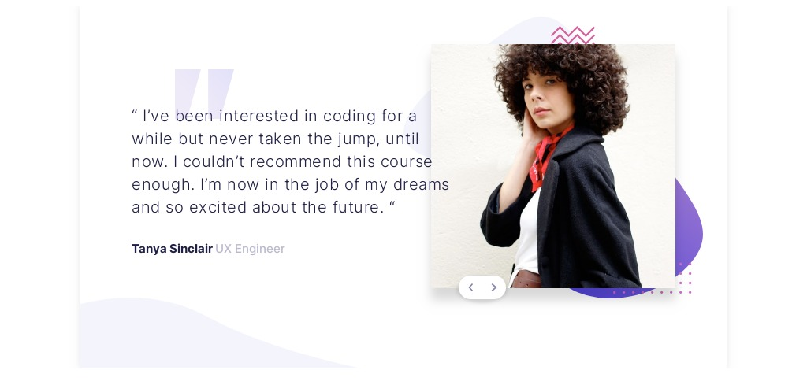

# Tetimonials Slider

> This slider shows you the best testimonials of the best coding bootcamp :D



This repo contains a simple slider component made with vanilla JS. As a demo, you can see the testimonials on the live demo page.

## Built With

- Plain HTML, CSS and JS
- Assets management with Webpack

## Live Demo

[Live Demo Link](https://testimonials-slider-livid.vercel.app/)


## Getting Started

To get a local copy of a dev environment up and running, follow these simple steps.

### Prerequisites
- NPM and Node

### Setup
1. Clone the repository
```
git clone git@github.com:mapra99/testimonials-slider.git

2. `cd` to the project folder
```
cd testimonials-slider
```

### Install
1. Install dependencies. We are using npm for this
```
npm install
```

2. Run the dev server
```
npm start
```

### Usage
Go to [http://localhost:8080](http://localhost:8080) and see the page :)

## Author

👤 **Miguel Prada**

- Github: [@mapra99](https://github.com/mapra99)
- Twitter: [@MiguelPrada1](https://twitter.com/MiguelPrada1)
- Linkedin: [mprada](https://linkedin.com/in/mprada)

## Contributing

Contributions, issues and feature requests are welcome :)

Feel free to check the [issues page](issues/).

## Show your support

Give a star if you like this project!

## Acknowledgments

- Frontendmentor for their amazing designs

## License

This project is [MIT](lic.url) licensed.
